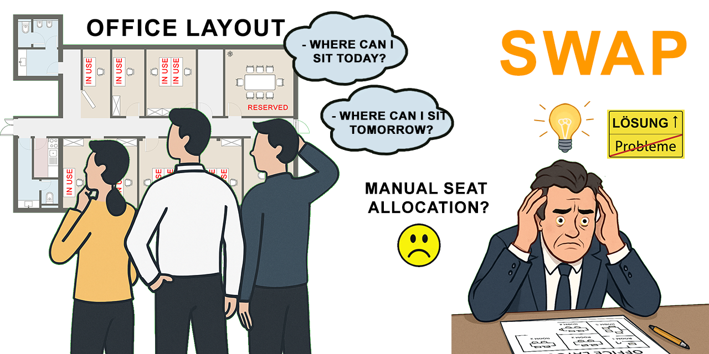
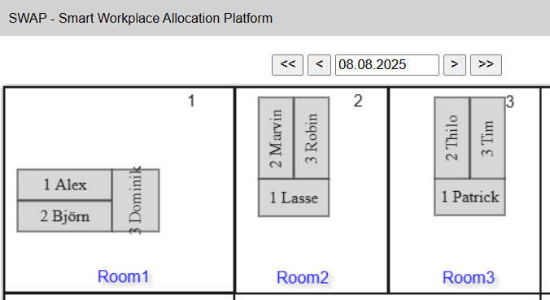

# Smart Workplace Allocation Platform ([SWAP](https://alex-lysenko-de.github.io/swap/))

### Sitzplatz Verteilungs Application

A practical example of using the [Hungarian Algorithm](https://en.wikipedia.org/wiki/Hungarian_algorithm) for the [Assignment Problem](https://en.wikipedia.org/wiki/Assignment_problem)

-----

## 📋 Table of Contents

1.  [Project Overview](#-project-overview)
2.  [Objectives](#-objectives)
3.  [How It Works](#%EF%B8%8F-how-it-works)
      * [Mathematical Model](#mathematical-model)
      * [Input Data](#input-data)
4.  [Key Features & Benefits](#input-data)
5.  [User Guide](#-user-guide)
      * [1. Starting the Application](#1-starting-the-application)
      * [2. Room and Workspace Planning](#2-room-and-workspace-planning)
      * [3. Switching to Planning Mode](#3-switching-to-planning-mode)
      * [4. Entering Schedules and Preferences](#4-entering-schedules-and-preferences)
      * [5. Automatic Calculation and Results](#5-automatic-calculation-and-results)
6.  [Results & Visualization](#-results--visualization)
7.  [Current Status](#-current-status)
8.  [Screenshots (Placeholder)](#%EF%B8%8F-screenshots-placeholder)
9.  [Next Steps](#-next-steps)

-----

## 🔍 Project Overview

The Smart Workplace Allocation Platform (SWAP) is an intelligent tool designed for the automated and flexible assignment of workspaces in dynamic environments, such as training centers or flexible offices. Developed for mid-sized IT service providers with multiple offices and a dedicated training facility, SWAP addresses the challenges of high-demand, fluctuating occupancy, and the need for team-based seating arrangements.

The platform automates the complex task of workspace assignment, ensuring an optimal and fair distribution of resources. It is particularly useful in environments with a high turnover of personnel, like students and interns, and where fixed seating arrangements aren't feasible.

**The Problem and SWAP's Solution:**
 **Problem:** Manually managing dynamic workspace assignments for fluctuating staff (students, interns, permanent employees) is complex, time-consuming, and prone to errors, often failing to optimally satisfy team-based and individual preferences.

 **Solution (SWAP):** An intelligent platform that automatically calculates the optimal seating plan by maximizing a global satisfaction function based on attendance schedules, user priorities, and individual seating preferences.

[🔙 ToC](#-table-of-contents)
-----

## 🎯 Objectives

The main goal of SWAP is to provide an automated solution for workspace allocation that:

  * Integrates **individual attendance schedules** and **seating preferences**.
  * Performs an **automatic seating calculation**.
  * Considers **user priorities** (e.g., permanent employees \> students \> interns).
  * Maximizes overall user satisfaction by fulfilling as many requests as possible.
  * Dynamically reacts to data changes.
  * Places members of the same project team together in the same room whenever possible.
  * Considers room availability and amenities.

[🔙 ToC](#-table-of-contents)
-----

## ⚙️ How It Works

### Mathematical Model

The core of SWAP's functionality is formulated as an **optimization problem** aimed at maximizing a global satisfaction function **U**, which aggregates the preferences and priorities of all users. The optimization is subject to constraints such as:

  * Room capacities.
  * Attendance times.
  * Seating conflicts and preferences.
  * Priorities of user groups.

This problem can be modeled as a classical [Assigment problem](https://en.wikipedia.org/wiki/Assignment_problem), a well-known combinatorial optimization problem. When formulated with linear constraints and a linear objective, it can be efficiently solved using the [Hungarian algorythm](https://en.wikipedia.org/wiki/Hungarian_algorithm) (also known as the **Kuhn-Munkres** algorithm), assuming the problem is balanced (i.e., equal number of agents and tasks). For more complex or unbalanced cases, advanced methods such as **Mixed Integer Programming** (MIP) or **Constraint Programming** (CP) may be applied.

### Input Data

The system's planning algorithm uses the following data for each participant:

  * **Period of Presence**: Start and end dates.
  * **Regular Days**: The specific weekdays a person is present.
  * **Planned Absences**: Vacations, business trips, or sick leave.
  * **Individual Preferences**: Preferred rooms or specific workspaces.
  

----

[🔙 ToC](#-table-of-contents)
-----

## ✨ Key Features & Benefits

  * **Flexibility**: The platform adapts dynamically to new users, schedules, and constraints.
  * **Automation**: It eliminates the need for manual planning, saving significant time.
  * **Fairness**: Decisions are automated, fair, and transparent, taking into account user priorities and preferences.
  * **Scalability**: Works efficiently for both small and large teams (10 to 1000+ participants).
  * **Interactive Visualization**: Provides a visual and interactive seating chart that can be viewed daily.

[🔙 ToC](#-table-of-contents)
-----

## 📝 User Guide

### 1\. Starting the Application

Open the [index.html](https://raw.githack.com/alex-lysenko-de/swap/main/index.html) file in a web browser. This will load the initial interface for planning the training center.

### 2\. Room and Workspace Planning

Draw the schematic layout of the training center by creating **rooms** and **workspaces** as rectangles. 

----

### 3\. Switching to Planning Mode

Click the "**Go To Demo Mode**" button to enter the planning mode.

----

### 4\. Entering Schedules and Preferences

Each participant enters their attendance details, including their period of presence, regular weekdays, planned absences, and preferred rooms or workplaces (tables).

----

### 5\. Automatic Calculation and Results

The system automatically calculates the optimal seating plan and visualizes it. You can view the daily plan and navigate through a calendar to see changes over time.

[🔙 ToC](#-table-of-contents)
-----

## 📊 Results & Visualization

  * **Interactive Plan View**: An overview that shows who is sitting where (room & seat) on a daily basis.
  * **Calendar View**: Allows navigation through weeks and months.
  * **Flexible Expansion**: The platform is designed to be expandable for real-world environments.
  

[🔙 ToC](#-table-of-contents)
-----

## ✅ Current Status

The project is a **functional prototype**. The core logic is implemented and has been validated with test data. The application's behavior is flexible and logical.

[🔙 ToC](#-table-of-contents)
-----

## 🖼️ Screenshots (Placeholder)

[🔙 ToC](#-table-of-contents)
-----

## ▶️ Next Steps

[🔙 ToC](#-table-of-contents)